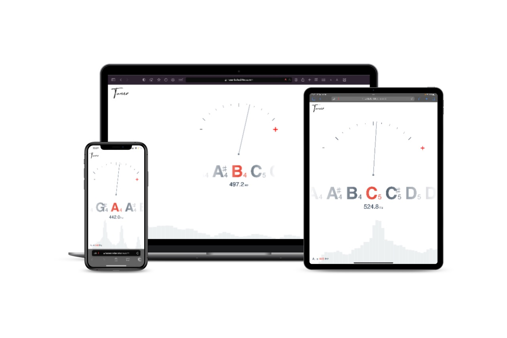

I added plus and minus signs to [qiuxiang](https://github.com/qiuxiang/tuner)'s project that turn red when the sound is wrong and green when the sound is correct.
At the same time, the indicator bar turns green when the correct sound is correct.

You can find this version of the project on my [website](https://hasanbahadirkoca.com/tuner).

Best regards to [qiuxiang](https://github.com/qiuxiang).

